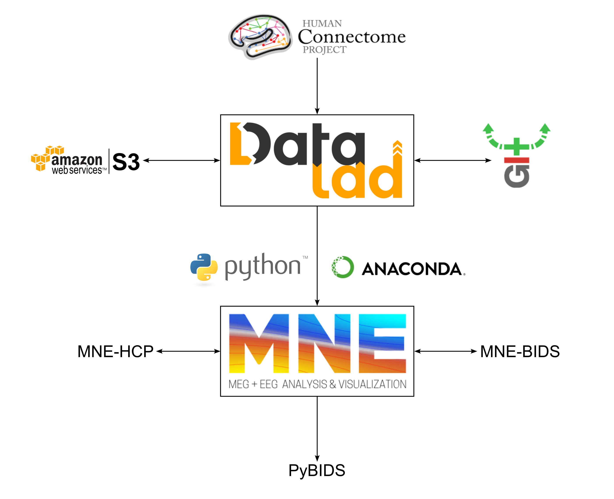

# Reproducible-workflow_HCP-MEG-subjects

  
*HCP-MEG example workflow*

### Disclaimer: 
The following is just an example of an unfinished workflow and doesn't provide ready-to-use scripts. Efforts are made to point you in the right direction whenever possible. 
Below you'll find a summary of the project and after that some notes on how you can use the various tools mentioned with some example commands and functions.
I credit all the developers of the software and projects referenced throughout the document for providing these tools.

## Introduction
The MEG community has witnessed a rise in interest in implementing standard and reproducible pipelines for data analysis ([Gross et al., 2013](https://doi.org/10.1016/j.neuroimage.2012.10.001); [Jas et al., 2018](https://doi.org/10.3389/fnins.2018.00530); [Niso et al., 2018](https://doi.org/10.1038/sdata.2018.110)). Recently, increasing efforts have been put forward by the core developers of the main software tools available (Brainstorm, Fieldtrip, and MNE-Python) to implement and enable robust and efficient compliance with those guidelines.

## Main Objectives
The aim of this project was to prepare the MEG data from the HCP-MEG subjects ([Larson-Prior et al., 2013](https://doi.org/10.1016/j.neuroimage.2013.05.056); [HCP dataset](https://db.humanconnectome.org/)) in a reproducible way to enable subsequent analyses using open-source software.

1. The MEG data was converted into a format compatible with MNE-Python ([stable release](https://mne.tools/stable/index.html)).
2. The next goals were to organize the data in the BIDS standard, validate this process, and use scripting tools to automatically query the dataset based on demographic information stored as file meta-data (as the sample includes 68 twins).
3. This opens up the possibility of investigating the role of genetic contributions to resting-state connectivity patterns ([Haak & Beckmann, 2019](https://doi.org/10.1038/s41467-019-11113-z)).
4. Another use case would be randomizing sample selection to exclude potential genetic confounds.

## Technical Implementation
I used [Datalad](https://www.datalad.org/) to access the HCP-MEG dataset from the command line (through an Amazon Web Services account). Datalad leverages git-annex, a version control tool, to download an exact and synchronized copy of this dataset.

Next, I created a conda virtual environment where I installed all the Python packages and dependencies required:

- **MNE-HCP** to convert the files into an MNE-compatible format ([mne-hcp](https://mne.tools/mne-hcp/index.html#)).
- **MNE-BIDS** to ‘BIDS-ify’ the data ([Appelhoff et al., 2019](https://doi.org/10.21105/joss.01896); [MNE-BIDS documentation](https://mne.tools/mne-bids/stable/index.html)).
- **PyBIDS** to query and manipulate the dataset ([PyBIDS documentation](https://bids-standard.github.io/pybids/index.html#)).

## Results
Overall, the integration of the computational tools reported provides an effective way to interact with the HCP-MEG data. This project provides a fully reproducible and version-controlled workflow for the HCP-MEG data, from downloading, preparing, and analyzing this dataset potentially all the way to storing the results and code in a public repository.

### Jump to the tutorial
([HCP-MEG_tutorial](https://github.com/mbedini/Reproducible-workflow_HCP-MEG/blob/main/tutorial.md)).
